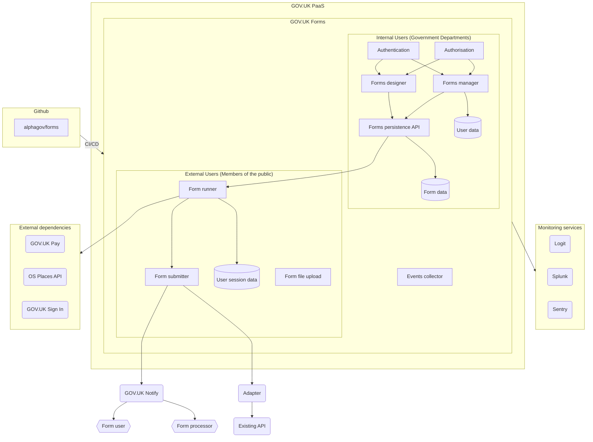

# Alpha Architecture Diagram

```mermaid
flowchart
  classDef subgraphPadding fill:none,stroke:none

  subgraph github[Github]
    alphagov/forms
  end

  subgraph monitoring[Monitoring services]
    logit(Logit)
    splunk(Splunk)
    sentry(Sentry)
  end

  subgraph paas[GOV.UK PaaS]
    subgraph paasPadding[ ]
      subgraph paasForms[GOV.UK Forms]
        subgraph paasFormsPadding[ ]
          subgraph internal["Internal Users (Government Departments)"]
            authorisation[Authorisation]
            authentication[Authentication]
            manager[Forms manager]
            designer[Forms designer]
            api[Forms persistence API]
            formDb[(Form data)]
            userDb[(User data)]

            manager --> api
            designer --> api
            api --> formDb
            manager --> userDb
            authorisation --> manager
            authorisation --> designer
            authentication --> manager
            authentication --> designer
          end
          
          subgraph external["External Users (Members of the public)"]
            runner[Form runner]
            submitter[Form submitter]
            userSessions[(User session data)]
            fileUpload[Form file upload]

            runner --> userSessions
            runner --> submitter
          end

          events[Events collector]
          api --> runner
        end
      end
    end
  end

  subgraph dependencies[External dependencies]
    pay(GOV.UK Pay)
    places(OS Places API)
    signin(GOV.UK Sign In)
  end

  notify(GOV.UK Notify)
  formUser{{Form user}}
  formProcessor{{Form processor}}
  adapter(Adapter)
  existingApi(Existing API)

  submitter --> notify
  notify --> formUser
  notify --> formProcessor
  submitter --> adapter
  adapter --> existingApi
  runner --> dependencies

  github --"CI/CD"--> paasForms
  paasForms --> monitoring

  class paasPadding subgraphPadding
  class paasFormsPadding subgraphPadding
```