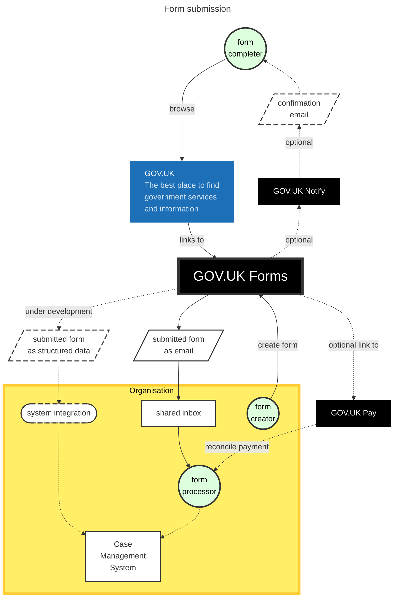

# GOV.UK Forms Architecture

```mermaid
---
title: Form submission
---

graph TD

    classDef default fill:#fff,stroke:#333,stroke-width:2px;

    classDef govuk fill:#1d70b8,stroke:#333,stroke-width:0px,color:#fff,text-align:left,font:arial;
    classDef forms fill:#000,stroke:#333,stroke-width:5px,color:#fff,font-size:28px;
    classDef notify fill:#000,stroke:#000,stroke-width:1px,color:#fff;
    classDef pay fill:#000,stroke:#000,stroke-width:1px,color:#fff;

    classDef org fill:#fe6,stroke:#fc3,stroke-width:5px,color:#000;

    classDef user fill:#dfd,stroke:#333,stroke-width:3px,color:#000;

    classDef optional stroke-dasharray: 10 5;

    user((form<br>completer))

    gov.uk[GOV.UK
    <font color=#d2e2f1>The best place to find
    government services
    and information</font>]
    forms[GOV.UK Forms]
    notify[GOV.UK Notify]
    pay[GOV.UK Pay]

    class gov.uk govuk
    class forms forms
    class notify notify
    class pay pay
    class gds gds


    subgraph org [Organisation]

        inbox[shared inbox]
        case[Case<br>Management<br>System]
        integration([system integration])

        creator((form<br>creator))
        processor((form<br>processor))

        integration -..-> case
        inbox --> processor -.-> case

    end
    
    confirmation[/confirmation<br/>email/]
    email[/submitted form<br/>as email/]
    data[/submitted form<br/>as structured data/]

    forms ~~~ creator
    creator -- create form --> forms

    user ~~~ confirmation ~~~ notify ~~~ forms

    user -- browse --> gov.uk -- links to --> forms -. optional .-> notify -. optional .-> confirmation -.-> user

    forms --> email --> inbox
    
    forms -. under development .-> data  -.-> integration

    forms -. optional link to .-> pay -. reconcile payment .-> processor

    class org org
    class user,processor,creator user
    class integration,data,confirmation optional

```
