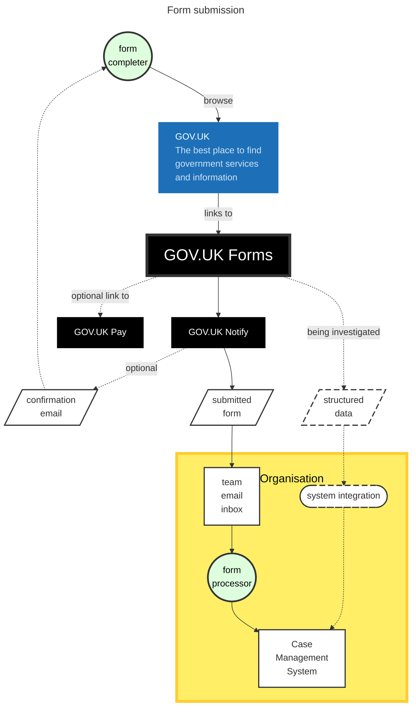

# GOV.UK Forms Architecture

```mermaid
---
title: Form submission
---

graph TD

    classDef default fill:#fff,stroke:#333,stroke-width:2px;

    classDef govuk fill:#1d70b8,stroke:#333,stroke-width:0px,color:#fff,text-align:left,font:arial;
    classDef forms fill:#000,stroke:#333,stroke-width:5px,color:#fff,font-size:28px;
    classDef notify fill:#000,stroke:#000,stroke-width:1px,color:#fff;
    classDef pay fill:#000,stroke:#000,stroke-width:1px,color:#fff;

    %%classDef gds fill:#fff,stroke:#333,stroke-width:1px,color:#888,padding:10px,font-size:28px;
    classDef org fill:#fe6,stroke:#fc3,stroke-width:5px,color:#000,padding:10px,font-size:20px;

    classDef user fill:#dfd,stroke:#333,stroke-width:3px,color:#000;

    classDef optional stroke-dasharray: 10 5;

    user((form<br>completer))

    %% subgraph gds [Government Digital Service]
        %% gov.uk[GOV.UK]
        gov.uk[GOV.UK
        <font color=#d2e2f1>The best place to find
        government services
        and information</font>]
        forms[GOV.UK Forms]
        notify[GOV.UK Notify]
        pay[GOV.UK Pay]
    %% end

    class gov.uk govuk
    class forms forms
    class notify notify
    class pay pay
    class gds gds


    subgraph org [Organisation]
        inbox[team<br>email<br/>inbox]
        case[Case<br>Management<br>System]
        %%rpa[Robotic<br/>Process<br/>Automation]
        integration([system integration])

        processor((form<br>processor))

        integration -..-> case
        inbox --> processor --> case
        %%inbox-.->rpa-.->case
        
    end
    
    class org org

    confirmation[/confirmation<br/>email/]
    email[/submitted<br/>form/]
    data[/structured<br/>data/]

class integration,data optional

    user -- browse --> gov.uk -- links to --> forms --> notify -. optional .-> confirmation -.-> user

    notify --> email --> inbox

    

    forms -. being investigated .-> data  -.-> integration

    forms -. optional link to .-> pay

    class user,processor user

```
