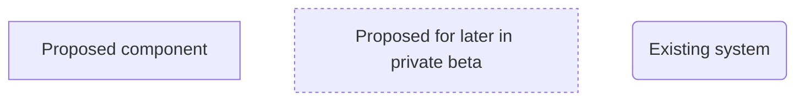
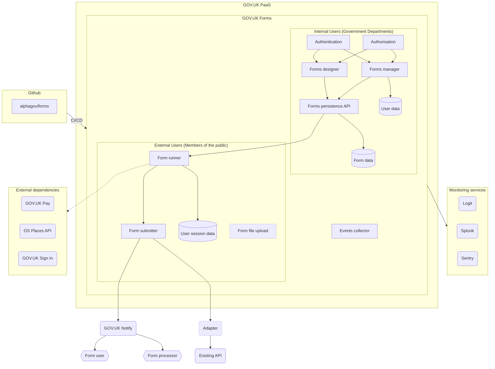

# Architecture Diagram

This diagram represents our most up to date view of the GOV.UK Forms architecture.

Each box doesn't necessarily correspond to a different application running, but instead "components" that form part of the entire GOV.UK Forms platform (E.g. The designer/manager could be the same application, but are distinct components to talk about).

