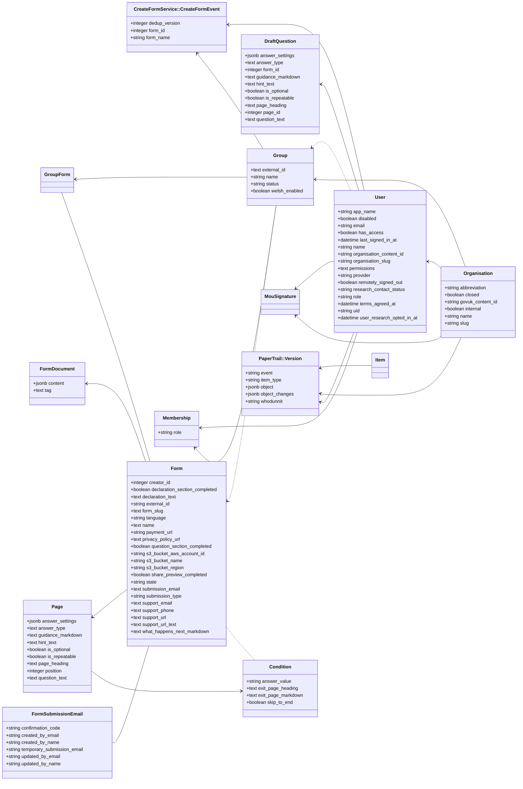

# GOV.UK Forms Admin app class diagram

```mermaid
classDiagram
	direction RL
	class `Condition`
	`Condition` : +string answer_value
	`Condition` : +text exit_page_heading
	`Condition` : +text exit_page_markdown
	`Condition` : +boolean skip_to_end
	class `CreateFormService::CreateFormEvent`
	`CreateFormService::CreateFormEvent` : +integer dedup_version
	`CreateFormService::CreateFormEvent` : +integer form_id
	`CreateFormService::CreateFormEvent` : +string form_name
	class `DraftQuestion`
	`DraftQuestion` : +jsonb answer_settings
	`DraftQuestion` : +text answer_type
	`DraftQuestion` : +integer form_id
	`DraftQuestion` : +text guidance_markdown
	`DraftQuestion` : +text hint_text
	`DraftQuestion` : +boolean is_optional
	`DraftQuestion` : +boolean is_repeatable
	`DraftQuestion` : +text page_heading
	`DraftQuestion` : +integer page_id
	`DraftQuestion` : +text question_text
	class `Form`
	`Form` : +integer creator_id
	`Form` : +boolean declaration_section_completed
	`Form` : +text declaration_text
	`Form` : +string external_id
	`Form` : +text form_slug
	`Form` : +string language
	`Form` : +text name
	`Form` : +string payment_url
	`Form` : +text privacy_policy_url
	`Form` : +boolean question_section_completed
	`Form` : +string s3_bucket_aws_account_id
	`Form` : +string s3_bucket_name
	`Form` : +string s3_bucket_region
	`Form` : +boolean share_preview_completed
	`Form` : +string state
	`Form` : +text submission_email
	`Form` : +string submission_type
	`Form` : +text support_email
	`Form` : +text support_phone
	`Form` : +text support_url
	`Form` : +text support_url_text
	`Form` : +text what_happens_next_markdown
	class `FormDocument`
	`FormDocument` : +jsonb content
	`FormDocument` : +text tag
	class `FormSubmissionEmail`
	`FormSubmissionEmail` : +string confirmation_code
	`FormSubmissionEmail` : +string created_by_email
	`FormSubmissionEmail` : +string created_by_name
	`FormSubmissionEmail` : +string temporary_submission_email
	`FormSubmissionEmail` : +string updated_by_email
	`FormSubmissionEmail` : +string updated_by_name
	class `Group`
	`Group` : +text external_id
	`Group` : +string name
	`Group` : +string status
	`Group` : +boolean welsh_enabled
	class `GroupForm`
	class `Membership`
	`Membership` : +string role
	class `MouSignature`
	class `Organisation`
	`Organisation` : +string abbreviation
	`Organisation` : +boolean closed
	`Organisation` : +string govuk_content_id
	`Organisation` : +boolean internal
	`Organisation` : +string name
	`Organisation` : +string slug
	class `Page`
	`Page` : +jsonb answer_settings
	`Page` : +text answer_type
	`Page` : +text guidance_markdown
	`Page` : +text hint_text
	`Page` : +boolean is_optional
	`Page` : +boolean is_repeatable
	`Page` : +text page_heading
	`Page` : +integer position
	`Page` : +text question_text
	class `PaperTrail::Version`
	`PaperTrail::Version` : +string event
	`PaperTrail::Version` : +string item_type
	`PaperTrail::Version` : +jsonb object
	`PaperTrail::Version` : +jsonb object_changes
	`PaperTrail::Version` : +string whodunnit
	class `User`
	`User` : +string app_name
	`User` : +boolean disabled
	`User` : +string email
	`User` : +boolean has_access
	`User` : +datetime last_signed_in_at
	`User` : +string name
	`User` : +string organisation_content_id
	`User` : +string organisation_slug
	`User` : +text permissions
	`User` : +string provider
	`User` : +boolean remotely_signed_out
	`User` : +string research_contact_status
	`User` : +string role
	`User` : +datetime terms_agreed_at
	`User` : +string uid
	`User` : +datetime user_research_opted_in_at
	`Item` --> `PaperTrail::Version`
	`Organisation` --> `PaperTrail::Version`
	`User` --> `PaperTrail::Version`
	`User` --> `CreateFormService::CreateFormEvent`
	`Group` --> `CreateFormService::CreateFormEvent`
	`Organisation` --> `User`
	`User` --> `Membership`
	`User` ..> `Group`
	`User` --> `MouSignature`
	`User` --> `DraftQuestion`
	`Organisation` --> `Group`
	`Organisation` --> `MouSignature`
	`Group` --> `Membership`
	`Group` --> `GroupForm`
	`Form` -- `GroupForm`
	`Group` ..> `Form`
	`Form` --> `FormDocument`
	`Form` --> `Page`
	`Form` -- `FormSubmissionEmail`
	`Page` --> `Condition`
	`Condition` .. `Form`
```
