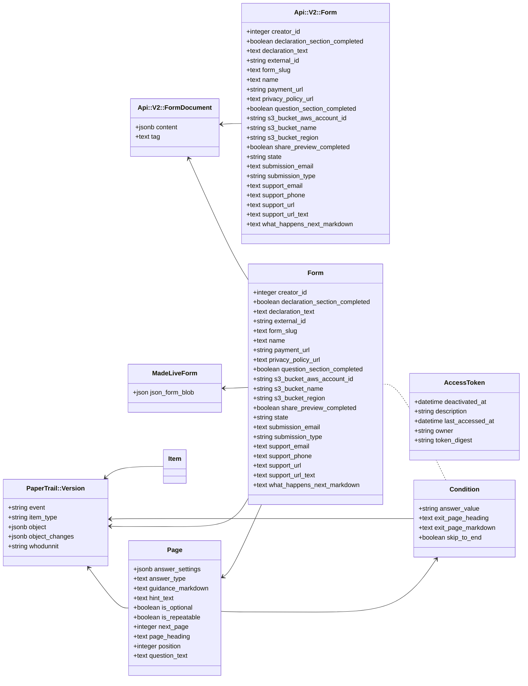

# GOV.UK Forms API class diagram
## 2025-05-29

```mermaid
classDiagram
	direction RL
	class `AccessToken`
	`AccessToken` : +datetime deactivated_at
	`AccessToken` : +string description
	`AccessToken` : +datetime last_accessed_at
	`AccessToken` : +string owner
	`AccessToken` : +string token_digest
	class `Api::V2::Form`
	`Api::V2::Form` : +integer creator_id
	`Api::V2::Form` : +boolean declaration_section_completed
	`Api::V2::Form` : +text declaration_text
	`Api::V2::Form` : +string external_id
	`Api::V2::Form` : +text form_slug
	`Api::V2::Form` : +text name
	`Api::V2::Form` : +string payment_url
	`Api::V2::Form` : +text privacy_policy_url
	`Api::V2::Form` : +boolean question_section_completed
	`Api::V2::Form` : +string s3_bucket_aws_account_id
	`Api::V2::Form` : +string s3_bucket_name
	`Api::V2::Form` : +string s3_bucket_region
	`Api::V2::Form` : +boolean share_preview_completed
	`Api::V2::Form` : +string state
	`Api::V2::Form` : +text submission_email
	`Api::V2::Form` : +string submission_type
	`Api::V2::Form` : +text support_email
	`Api::V2::Form` : +text support_phone
	`Api::V2::Form` : +text support_url
	`Api::V2::Form` : +text support_url_text
	`Api::V2::Form` : +text what_happens_next_markdown
	class `Api::V2::FormDocument`
	`Api::V2::FormDocument` : +jsonb content
	`Api::V2::FormDocument` : +text tag
	class `Condition`
	`Condition` : +string answer_value
	`Condition` : +text exit_page_heading
	`Condition` : +text exit_page_markdown
	`Condition` : +boolean skip_to_end
	class `Form`
	`Form` : +integer creator_id
	`Form` : +boolean declaration_section_completed
	`Form` : +text declaration_text
	`Form` : +string external_id
	`Form` : +text form_slug
	`Form` : +text name
	`Form` : +string payment_url
	`Form` : +text privacy_policy_url
	`Form` : +boolean question_section_completed
	`Form` : +string s3_bucket_aws_account_id
	`Form` : +string s3_bucket_name
	`Form` : +string s3_bucket_region
	`Form` : +boolean share_preview_completed
	`Form` : +string state
	`Form` : +text submission_email
	`Form` : +string submission_type
	`Form` : +text support_email
	`Form` : +text support_phone
	`Form` : +text support_url
	`Form` : +text support_url_text
	`Form` : +text what_happens_next_markdown
	class `MadeLiveForm`
	`MadeLiveForm` : +json json_form_blob
	class `Page`
	`Page` : +jsonb answer_settings
	`Page` : +text answer_type
	`Page` : +text guidance_markdown
	`Page` : +text hint_text
	`Page` : +boolean is_optional
	`Page` : +boolean is_repeatable
	`Page` : +integer next_page
	`Page` : +text page_heading
	`Page` : +integer position
	`Page` : +text question_text
	class `PaperTrail::Version`
	`PaperTrail::Version` : +string event
	`PaperTrail::Version` : +string item_type
	`PaperTrail::Version` : +jsonb object
	`PaperTrail::Version` : +jsonb object_changes
	`PaperTrail::Version` : +string whodunnit
	`Item` --> `PaperTrail::Version`
	`Condition` --> `PaperTrail::Version`
	`Form` --> `PaperTrail::Version`
	`Page` --> `PaperTrail::Version`
	`Api::V2::Form` --> `Api::V2::FormDocument`
	`Form` --> `Page`
	`Page` --> `Condition`
	`Form` --> `MadeLiveForm`
	`Form` --> `Api::V2::FormDocument`
	`Condition` .. `Form`
```
