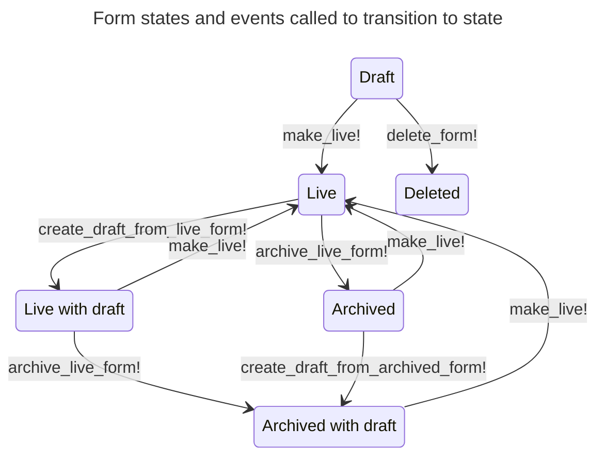

# Form states and events used by state machine

## State diagram

## State definitions

### Draft

A form in `draft` state can transition to two states, [deleted](#deleted) or [live](#live). When a form is in this state, the form is not an offical document and can be deleted. There is a guard in place to ensure that a form can only transition to `live` state once all the required sections are completed. At this point `make_live!` event can be called and transition the state to `live`. 

### Deleted

A forms state is set to `deleted` before it is HARD deleted. The reason this state exists is so that we can guard against accidental deletion of forms that at some point have been made live and there are now offical and part of the corporate document history. 

### Live

A form in `live` state can transition to two states, [live_with_draft](#live-with-draft) and temporarly back to [draft](#draft) until `archive` state has been implemented. 
When a form transitions into `live` state 
- it is now considered an official document and should not be HARD deleted. 
- a snapshot of Form, Pages & Conditions are taken and stored as a new record in `made_live_forms` table
- if a previously live form is updated and the submission email has changed, forms-admin will notify the original submission email of the change and notify them not to expect any further form submissions

  
### Live with draft

A form in `live_with_draft` state can transition to two states, [live](#live) and temporarly back to [draft](#draft) until `archive` state has been implemented. 
This state means that since the form was made live something (Form, Pages or Conditions) have been updated which needs to be reviewed and the changes to be made live.

