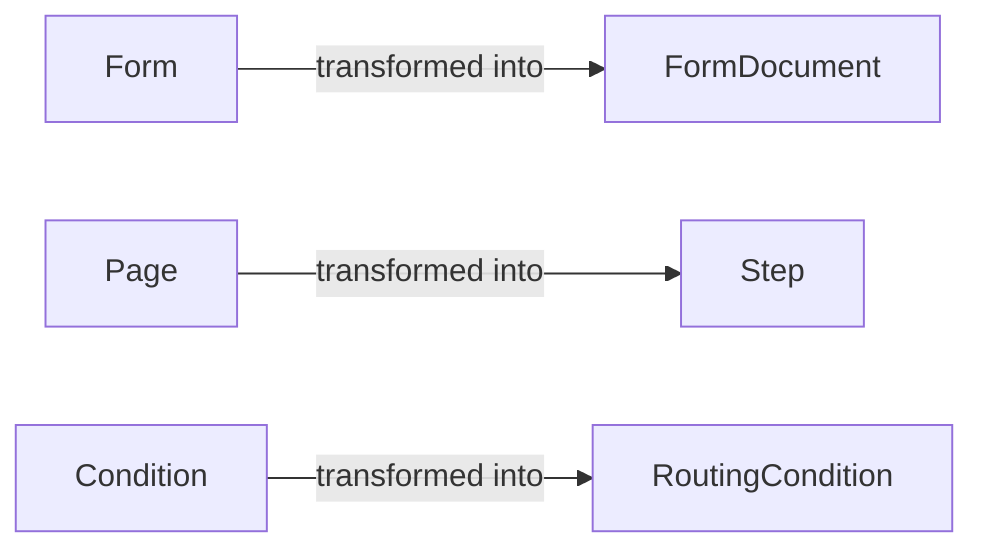
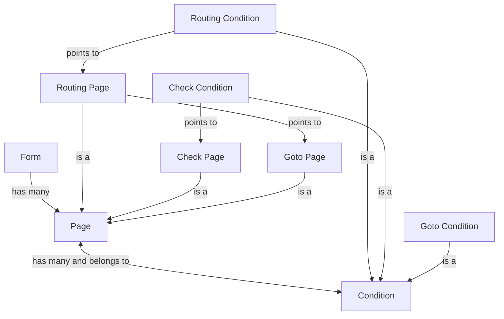
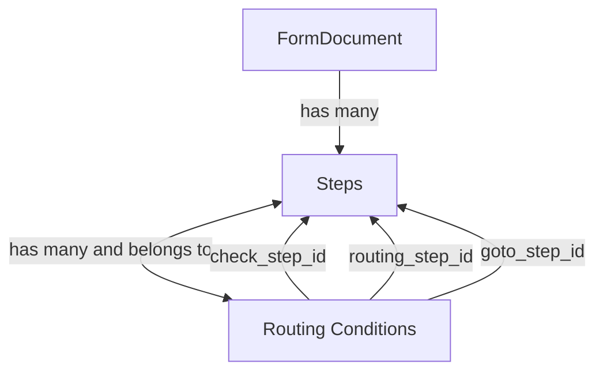

# Form and FormDocument object mappings

## What gets turned into what?



Forms are transformed into Pages, and Pages are transformed into Steps.

Form has a method to transform into a FormDocument called [as_form_document](https://github.com/alphagov/forms-admin/blob/main/app/models/form.rb#L147-L155).

The Page to Step transformation by [this method in the Page](https://github.com/alphagov/forms-admin/blob/main/app/models/page.rb#L94) class.

It basically puts the positional attributes such at the position and ID at the top-level of the step and the other attributes within the "data" field. We add a "type" which for now is always "question_page", but could be "question_set" in the future. This maps mainly onto Option 1 in [this RFC](https://github.com/alphagov/forms/discussions/174) from a while ago.

## How they relate

### Forms


### FormDocuments


A FormDocument would include the following:

```json
{
     "step": {
          id: 18
      /* ..other steps attributes... */
      "routing_conditions": [
        {
          "id": 3,
          "check_step_id": 18,
          "routing_step_id": 18,
          "goto_step_id": null,
          "answer_value": "Yes",
          "created_at": "2024-08-02T08:54:07.479Z",
          "updated_at": "2024-08-02T08:54:07.479Z",
          "skip_to_end": true,
          "validation_errors": []
        }
      ]
   }
}
```

The `step.id`, is the id of the step (which is a `Page` in active record but stored as `step` in the `FormDocument`).

`step.routing_conditions` contains an array of `Conditions` linked to the `step` through `routing_step_id`. `check_step_id` and `goto_step_id` are references to other `steps` in the form. These are just references, not extra conditions. All Conditions have a `routing_step_id` which links them to a `Step`.