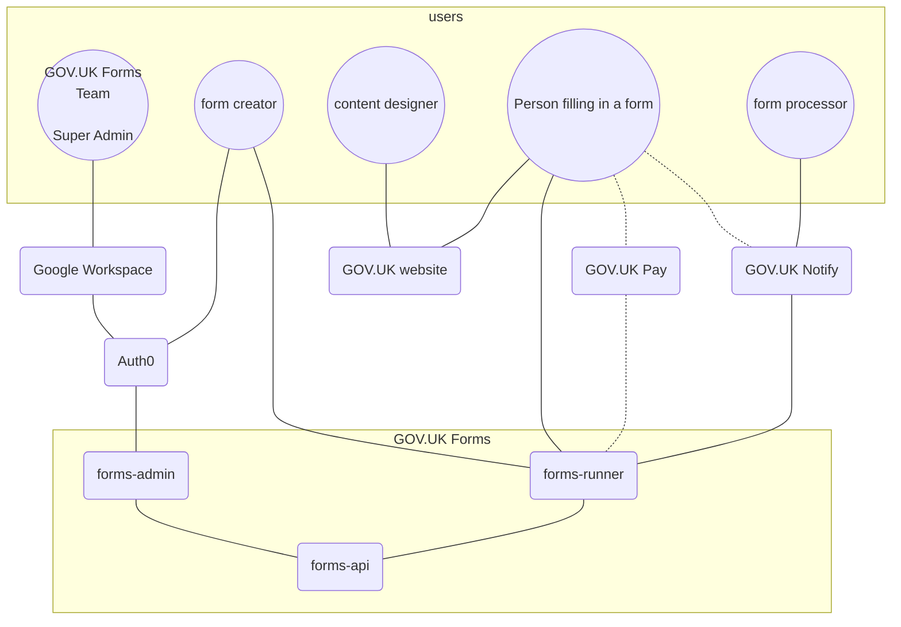

# GOV.UK Forms Sequence Diagrams 

## Introduction

The diagrams in this folder (created using [Mermaid](https://docs.github.com/en/get-started/writing-on-github/working-with-advanced-formatting/creating-diagrams#creating-mermaid-diagrams)) show the interactions between users and GOV.UK Forms, including the 3 applications [forms-admin](https://github.com/alphagov/forms-admin), [forms-api](https://github.com/alphagov/forms-api), and [forms-runner](https://github.com/alphagov/forms-runner).

## High Level Architecture of GOV.UK Forms

## Links to Sequence Diagrams

* [authentication](authentication.md)
* [creating a form](creating-a-form.md)
* [publishing a form](publishing-a-form.md)
* [filling in a form](filling-in-a-form.md)
* [changing a form](changing-a-form.md)

