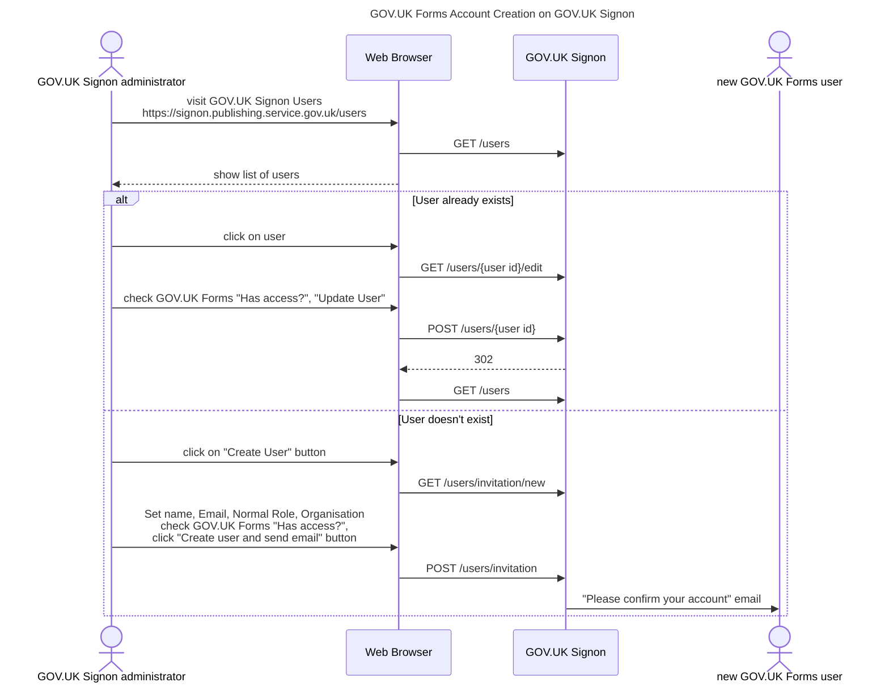
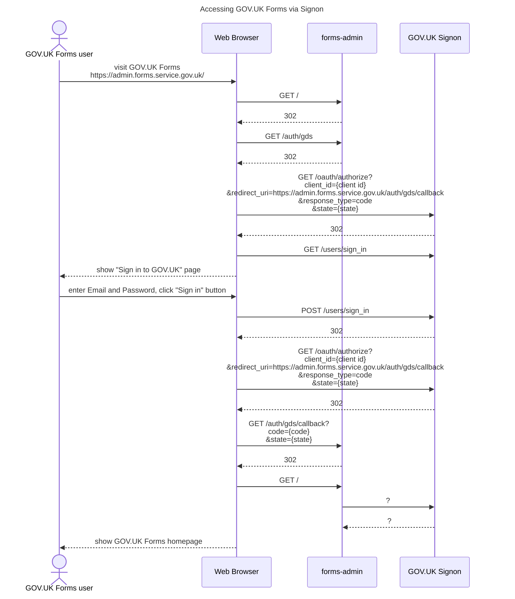
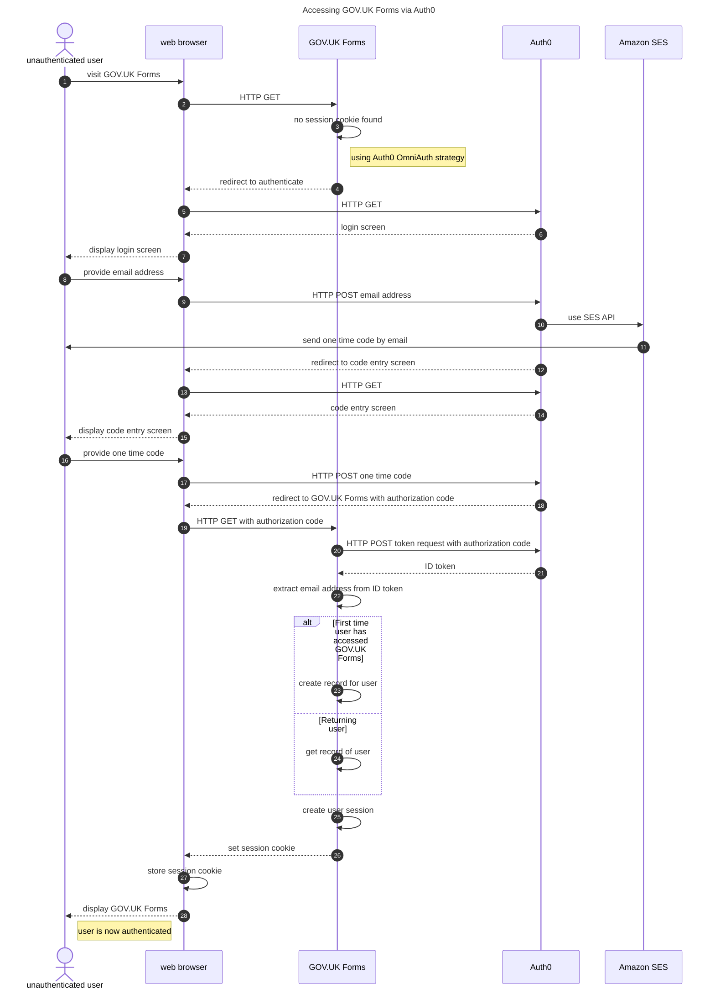

## GOV.UK Forms Account Creation on GOV.UK Signon

```mermaid
sequenceDiagram
  title GOV.UK Forms Account Creation on GOV.UK Signon
  actor user as GOV.UK Signon administrator
  participant browser as Web Browser
  participant signon as GOV.UK Signon
  link signon: signon Developer docs @ https://docs.publishing.service.gov.uk/repos/signon.html
  actor new_user as new GOV.UK Forms user

  user->>browser: visit GOV.UK Signon Users<br />https://signon.publishing.service.gov.uk/users
  browser->>signon: GET /users
  browser-->>user: show list of users

  alt User already exists
    user->>browser: click on user
    browser->>signon: GET /users/{user id}/edit
    user->>browser: check  GOV.UK Forms "Has access?", "Update User"
    browser->>signon: POST /users/{user id}
    signon-->>browser: 302
    browser->>signon: GET /users
  else User doesn't exist
    user->>browser: click on "Create User" button
    browser->>signon: GET /users/invitation/new
    user->>browser: Set name, Email, Normal Role, Organisation<br />check GOV.UK Forms "Has access?",<br />click "Create user and send email" button
    browser->>signon: POST /users/invitation
    signon->>new_user: "Please confirm your account" email
  end

```

## Accessing GOV.UK Forms via Signon

```mermaid
sequenceDiagram
  title Accessing GOV.UK Forms via Signon
  actor user as GOV.UK Forms user
  participant browser as Web Browser
  participant admin as forms-admin
  link admin: GitHub repo @ https://github.com/alphagov/forms-admin
  participant signon as GOV.UK Signon
  link signon: signon Developer docs @ https://docs.publishing.service.gov.uk/repos/signon.html

  user->>browser: visit GOV.UK Forms<br />https://admin.forms.service.gov.uk/
  browser->>admin: GET /
  admin-->>browser: 302
  browser->>admin: GET /auth/gds
  admin-->>browser: 302
  browser->>signon: GET /oauth/authorize?<br />client_id={client id}<br />&redirect_uri=https://admin.forms.service.gov.uk/auth/gds/callback<br />&response_type=code<br />&state={state}
  signon-->>browser: 302
  browser->>signon: GET /users/sign_in
  browser-->>user: show "Sign in to GOV.UK" page

  user->>browser: enter Email and Password, click "Sign in" button
  browser->>signon: POST /users/sign_in
  signon-->>browser: 302
  browser->>signon: GET /oauth/authorize?<br />client_id={client id}<br />&redirect_uri=https://admin.forms.service.gov.uk/auth/gds/callback<br />&response_type=code<br />&state={state}
  signon-->>browser: 302
  browser->>admin: GET /auth/gds/callback?<br />code={code}<br />&state={state}
  admin-->>browser: 302
  browser->>admin: GET /

  admin->>signon: ?
  signon-->>admin: ?

  browser-->>user: show GOV.UK Forms homepage
```

## Accessing GOV.UK Forms via Auth0

```mermaid
sequenceDiagram
    autonumber
    title Accessing GOV.UK Forms via Auth0
    actor user as unauthenticated user
    participant browser as web browser
    participant forms as GOV.UK Forms
    participant auth0 as Auth0
    participant ses as Amazon SES

    user ->> browser: visit GOV.UK Forms
    browser ->> forms: HTTP GET
    forms ->> forms: no session cookie found
    note right of forms: using Auth0 OmniAuth strategy
    forms -->> browser: redirect to authenticate
    browser ->> auth0: HTTP GET
    auth0 -->> browser: login screen
    browser -->> user: display login screen

    user ->> browser: provide email address
    browser ->> auth0: HTTP POST email address
    auth0 ->> ses: use SES API
    ses ->> user: send one time code by email
    auth0 -->> browser: redirect to code entry screen
    browser ->> auth0: HTTP GET
    auth0 -->> browser: code entry screen
    browser -->> user: display code entry screen

    user ->> browser: provide one time code
    browser ->> auth0: HTTP POST one time code
    auth0 -->> browser: redirect to GOV.UK Forms with authorization code

    browser ->> forms: HTTP GET with authorization code
    forms ->> auth0: HTTP POST token request with authorization code
    auth0 -->> forms: ID token
    forms ->> forms: extract email address from ID token
    alt First time user has accessed GOV.UK Forms
        forms ->> forms: create record for user
    else Returning user
        forms ->> forms: get record of user
    end
    forms ->> forms: create user session
    forms -->> browser: set session cookie
    browser ->> browser: store session cookie
    browser -->> user: display GOV.UK Forms

    note right of user: user is now authenticated

```
