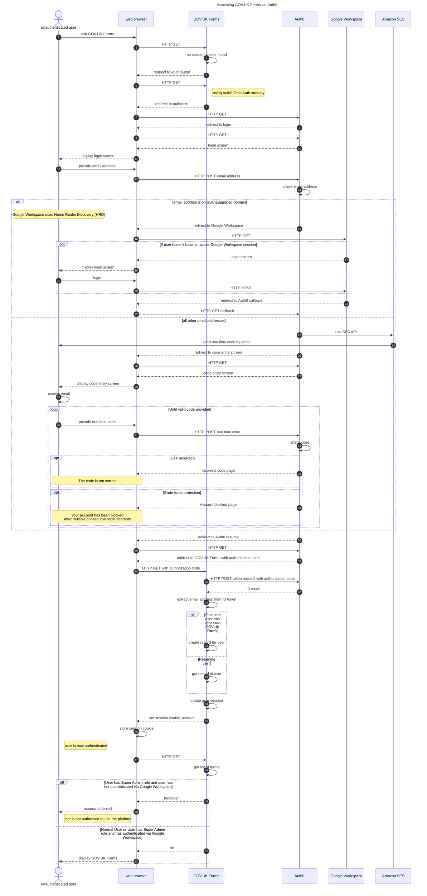

## Accessing GOV.UK Forms via Auth0

```mermaid
sequenceDiagram
    autonumber
    title Accessing GOV.UK Forms via Auth0
    actor user as unauthenticated user
    participant browser as web browser
    participant forms as GOV.UK Forms
    participant auth0 as Auth0
    participant gw as Google Workspace
    participant ses as Amazon SES

    user ->> browser: visit GOV.UK Forms
    browser ->> forms: HTTP GET
    forms ->> forms: no session cookie found
    forms -->> browser: redirect to /auth/auth0
    browser->> forms: HTTP GET


    note right of forms: using Auth0 OmniAuth strategy
    forms -->> browser: redirect to authorize
    browser ->> auth0: HTTP GET
    auth0 -->> browser: redirect to login
    browser ->> auth0: HTTP GET

    auth0 -->> browser: login screen
    browser -->> user: display login screen

    user ->> browser: provide email address
    browser ->> auth0: HTTP POST email address
    auth0 ->> auth0: check email address
    alt email address is on SSO-supported domain
      note over user: Google Workspace uses Home Realm Discovery (HRD)
      auth0 ->> browser: redirect to Google Workspace
      browser ->> gw: HTTP GET
      opt If user doesn't have an active Google Workspace session
        gw -->> browser: login screen
        browser -->> user: display login screen
        user ->> browser: login
        browser ->> gw: HTTP POST
      end

      gw -->> browser: redirect to Auth0 callback

      browser ->> auth0: HTTP GET callback

    else all other email addresses
      auth0 ->> ses: use SES API
      ses ->> user: send one time code by email
      auth0 -->> browser: redirect to code entry screen
      browser ->> auth0: HTTP GET
      auth0 -->> browser: code entry screen
      browser -->> user: display code entry screen

      user ->> user: access email


      loop Until valid code provided
        user ->> browser: provide one time code
        browser ->> auth0: HTTP POST one time code

        auth0 ->> auth0: check code

        opt OTP incorrect
          auth0 -->> browser: Incorrect code page
          note over user,browser: The code is not correct
        end

        opt Brute force protection
          auth0 -->> browser: Account blocked page
          note over user,browser: Your account has been blocked<br />after multiple consecutive login attempts
        end
      end
    end

      auth0 -->> browser: redirect to Auth0 resume
      browser ->> auth0: HTTP GET

      auth0 -->> browser: redirect to GOV.UK Forms with authorization code

    browser ->> forms: HTTP GET with authorization code
    forms ->> auth0: HTTP POST token request with authorization code
    auth0 -->> forms: ID token
    forms ->> forms: extract email address from ID token
    alt First time user has accessed GOV.UK Forms
        forms ->> forms: create record for user
    else Returning user
        forms ->> forms: get record of user
    end

    forms ->> forms: create user session
    forms -->> browser: set session cookie, redirect
    browser ->> browser: store session cookie
    note right of user: user is now authenticated
    browser ->> forms: HTTP GET
    forms ->> forms: get list of forms

    alt User has Super Admin role and user has not authenticated via Google Workspace
      forms -->> browser: forbidden
      browser -->> user: access is denied
      note right of user: user is not authorised to use the platform
    else Normal User or User has Super Admin role and has authenticated via Google Workspace
      forms -->> browser: ok
      browser -->> user: display GOV.UK Forms
    end
```
