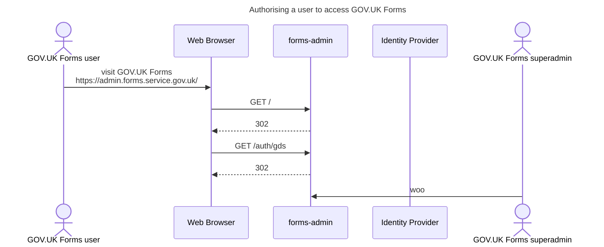

## Authorising a user to access GOV.UK Forms

```mermaid
sequenceDiagram
  title Authorising a user to access GOV.UK Forms
  actor user as GOV.UK Forms user
  participant browser as Web Browser
  participant admin as forms-admin
  participant idp as Identity Provider
  actor superadmin as GOV.UK Forms superadmin

  user->>browser: visit GOV.UK Forms<br />https://admin.forms.service.gov.uk/
  browser->>admin: GET /
  admin-->>browser: 302
  browser->>admin: GET /auth/gds
  admin-->>browser: 302
  superadmin->>admin: woo
  
```