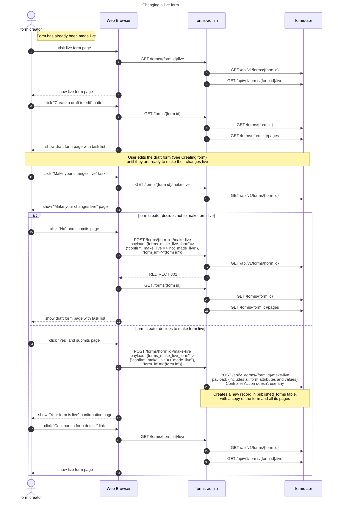

# Changing a live form

```mermaid 
%%{init:{"sequence": { "showSequenceNumbers": true }}}%%
sequenceDiagram
  title Changing a live form
  actor user as form creator
  participant browser as Web Browser
  participant admin as forms-admin
  link admin: GitHub repo @ https://github.com/alphagov/forms-admin   
  participant api as forms-api
  link api: GitHub repo @ https://github.com/alphagov/forms-api 

  note right of user: Form has already been made live

  user->>browser: visit live form page
  browser->>admin: GET /forms/{form id}/live
  admin->>api: GET /api/v1/forms/{form id}
  admin->>api: GET /api/v1/forms/{form id}/live
  browser-->>user: show live form page
  
  user->>browser: click "Create a draft to edit" button
  browser->>admin: GET /forms/{form id}
  admin->>api: GET /forms/{form id}
  admin->>api: GET /forms/{form id}/pages
  browser-->>user: show draft form page with task list
  
  note over user,api: User edits the draft form (See Creating form)<br>until they are ready to make their changes live

  user->>browser: click "Make your changes live" task
  browser->>admin: GET /forms/{form id}/make-live
  admin->>api: GET /api/v1/forms/{form id}
  browser-->>user: show "Make your changes live" page
  alt form creator decides not to make form live
    user->>browser: click "No" and submits page
    browser->>admin: POST /forms/{form id}/make-live<br>payload: {forms_make_live_form"=><br>{"confirm_make_live"=>"not_made_live"},<br>"form_id"=>"{form id"}}
    admin->>api: GET /api/v1/forms/{form id}
    admin-->>browser: REDIRECT 302
    browser->>admin: GET /forms/{form id}
    admin->>api: GET /forms/{form id}
    admin->>api: GET /forms/{form id}/pages
    browser-->>user: show draft form page with task list
  else form creator decides to make form live
    user->>browser: click "Yes" and submits page
    browser->>admin: POST /forms/{form id}/make-live<br>payload: {forms_make_live_form"=><br>{"confirm_make_live"=>"made_live"},<br>"form_id"=>"{form id"}}
    admin->>api: POST /api/v1/forms/{form id}/make-live<br>payload: {includes all form attributes and values}<br>Controller Action doesn't use any
    note over admin,api: Creates a new record in published_forms table,<br>with a copy of the form and all its pages<br>
    browser-->>user: show "Your form is live" confirmation page
    user->>browser: click "Continue to form details" link
    browser->>admin: GET /forms/{form id}/live
    admin->>api: GET /api/v1/forms/{form id}
    admin->>api: GET /api/v1/forms/{form id}/live
    browser-->>user: show live form page
  end
```
