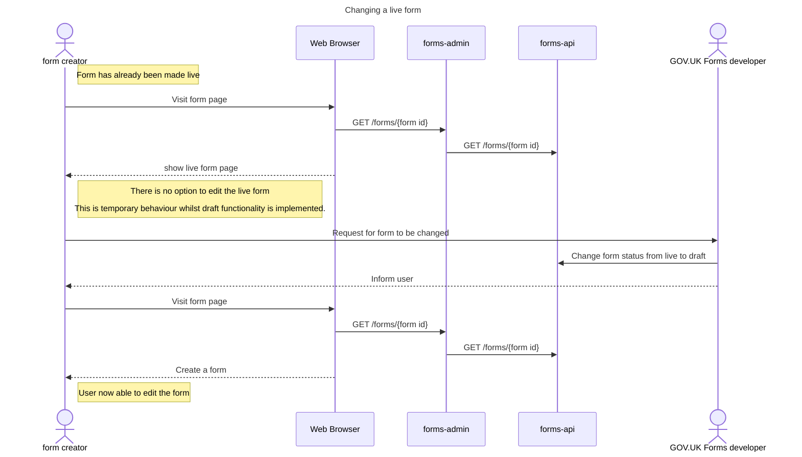

# Changing a live form

```mermaid 
sequenceDiagram
  title Changing a live form
  actor user as form creator
  participant browser as Web Browser
  participant admin as forms-admin
  link admin: GitHub repo @ https://github.com/alphagov/forms-admin   
  participant api as forms-api
  link api: GitHub repo @ https://github.com/alphagov/forms-api 
  actor dev as GOV.UK Forms developer

  note right of user: Form has already been made live

  user->>browser: Visit form page
  browser->>admin: GET /forms/{form id}
  admin->>api: GET /forms/{form id}
  browser-->>user: show live form page
  
  note right of user: There is no option to edit the live form<br /><br />This is temporary behaviour whilst draft functionality is implemented.
  
  user->>dev: Request for form to be changed
  dev->>api: Change form status from live to draft
  dev-->>user: Inform user
  
  user->>browser: Visit form page
  browser->>admin: GET /forms/{form id}
  admin->>api: GET /forms/{form id}
  browser-->>user: Create a form
  
  note right of user: User now able to edit the form
```
