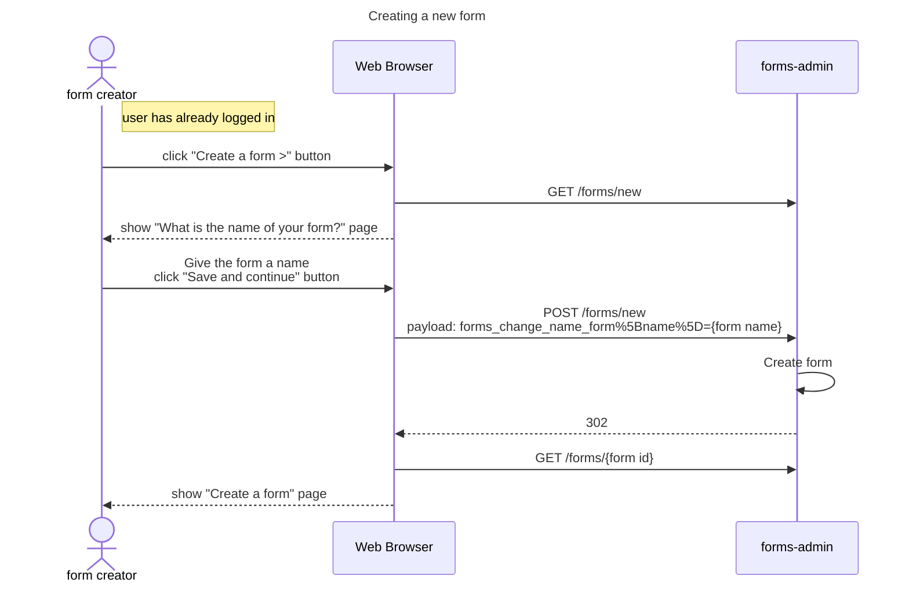
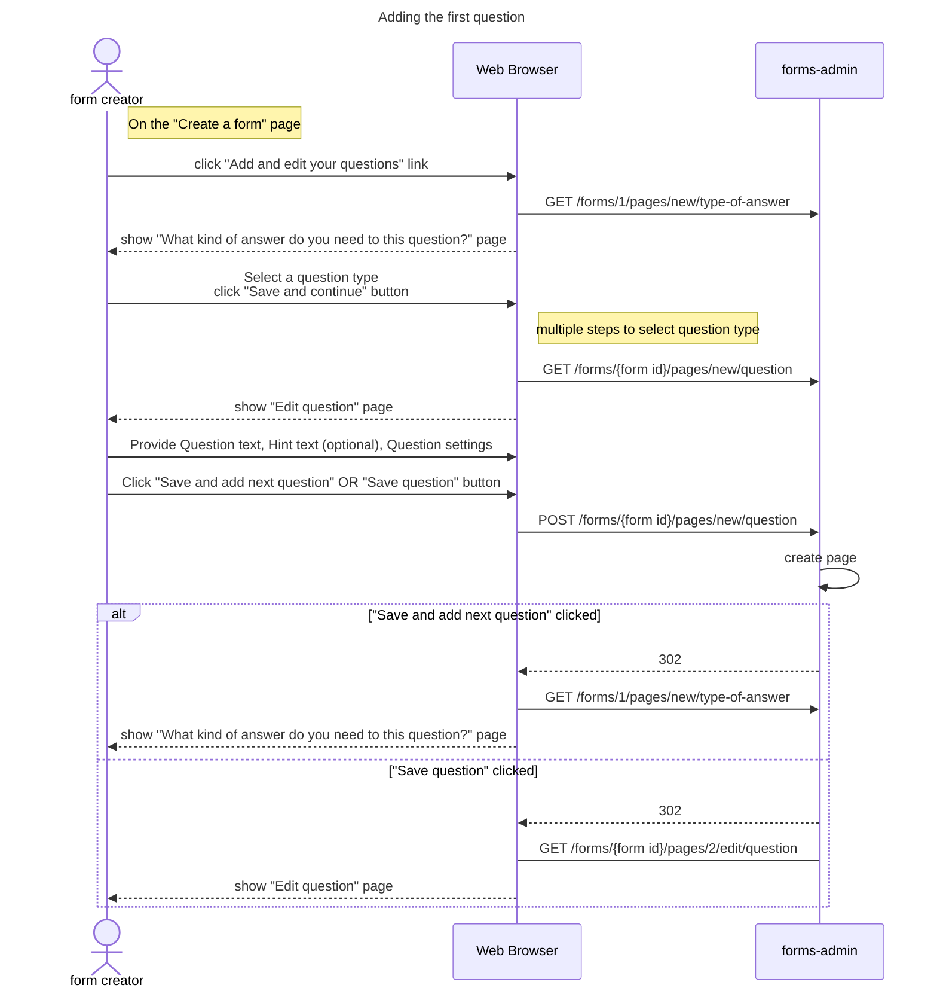
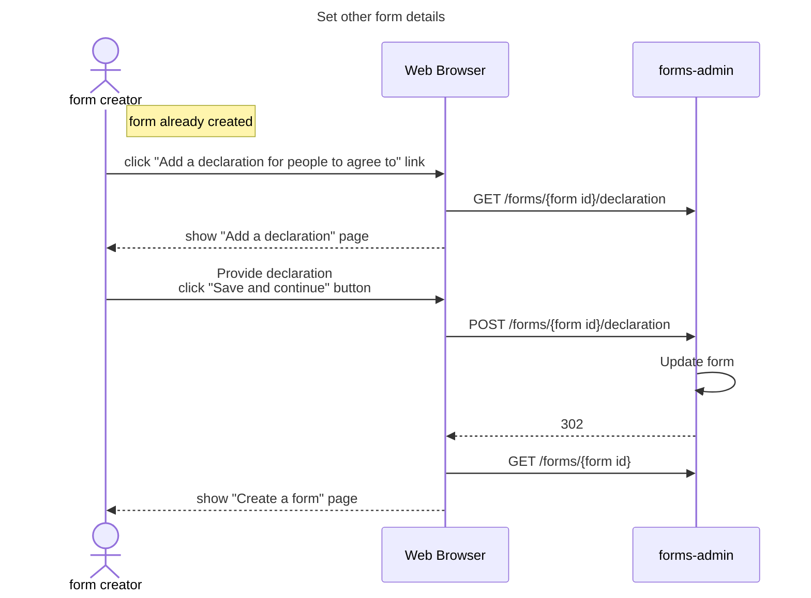
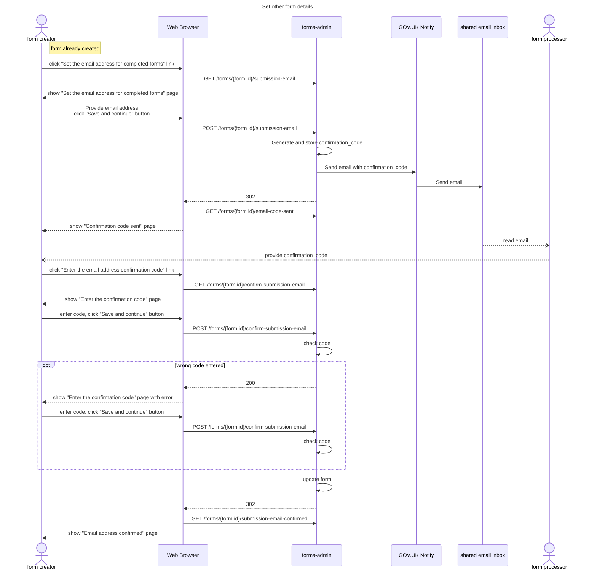
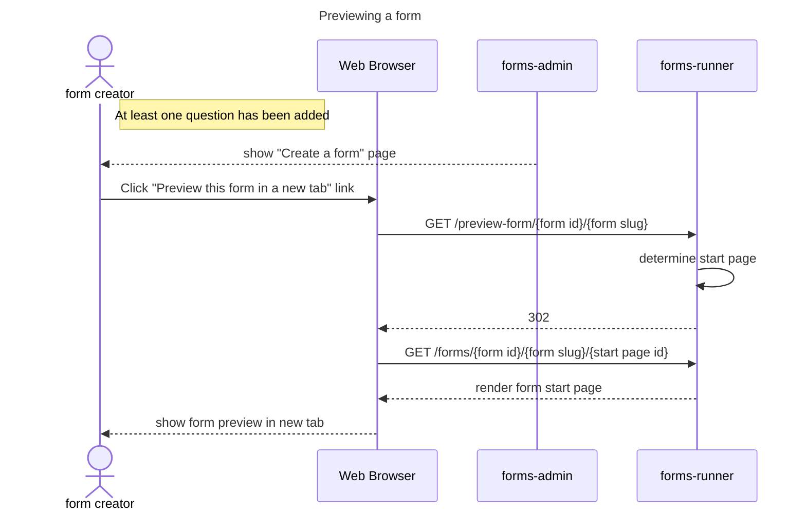

## Creating a form

## Adding the first question

## Set other form details

Diagram shows "declaration". Flow is equivalent for

* what-happens-next
* privacy-policy
* contact-details

## Set email address for completed forms

## Previewing a form

