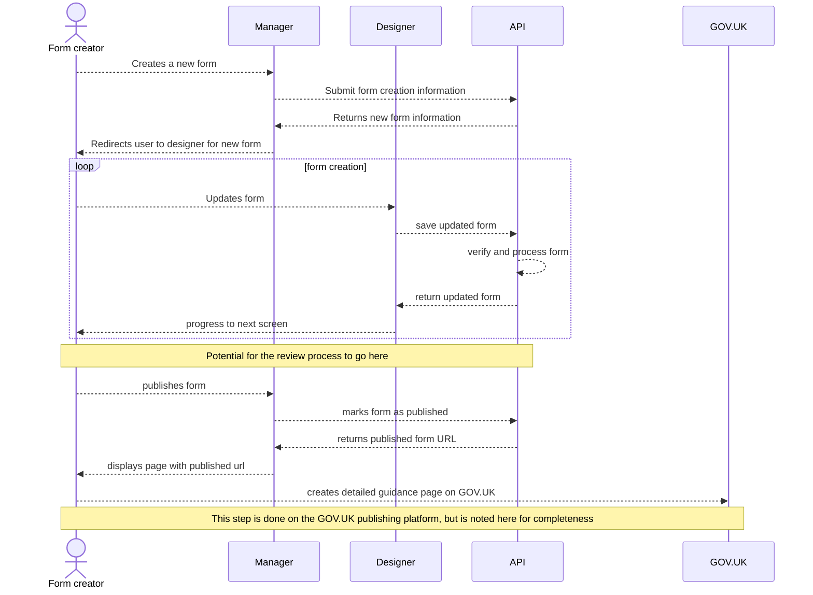

# Creating and publishing a form

```mermaid 
sequenceDiagram
  actor user as Form creator
  participant manager as Manager
  participant designer as Designer
  participant api as API
  participant govuk as GOV.UK

  user -->> manager: Creates a new form
  manager -->> api: Submit form creation information
  api -->> manager: Returns new form information
  manager -->> user: Redirects user to designer for new form
  loop form creation
    user -->> designer: Updates form
    designer -->> api: save updated form
    api -->> api: verify and process form
    api -->> designer: return updated form
    designer -->> user: progress to next screen
  end

  note over user,api: Potential for the review process to go here

  user -->> manager: publishes form
  manager -->> api: marks form as published
  api -->> manager: returns published form URL
  manager -->> user: displays page with published url
  user -->> govuk: creates detailed guidance page on GOV.UK
  note over user,govuk: This step is done on the GOV.UK publishing platform, but is noted here for completeness
```