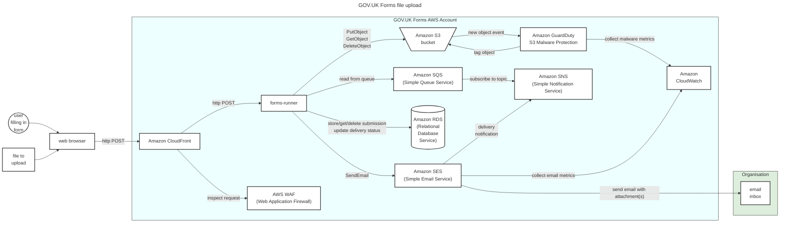
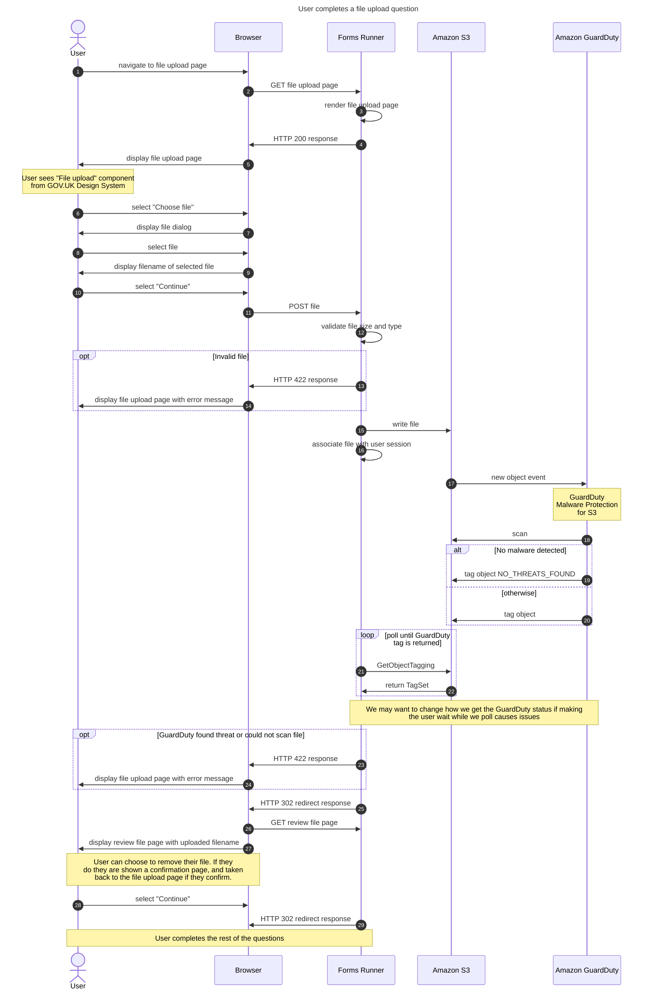

## File Upload Architecture

```mermaid
---
title: GOV.UK Forms file upload
---

graph LR

    user((user<br />filling in<br />form))
    file[file to<br />upload]
    browser[web browser]

    user --> browser --http POST--> cloudfront --http POST--> forms --PutObject<br/>GetObject<br/>DeleteObject--> s3
    forms --SendEmail--> ses --send email with attachment(s)----> inbox
    file --> browser

    subgraph forms_aws [GOV.UK Forms AWS Account]
        cloudfront[Amazon CloudFront]
        waf["AWS WAF<br />(Web Application Firewall)"]
        forms[forms-runner]
        rds[("Amazon RDS<br/>(Relational<br/>Database<br/>Service)")]
        s3[\Amazon S3<br />bucket/]
        guardduty[Amazon GuardDuty<br />S3 Malware Protection]
        ses["Amazon SES<br />(Simple Email Service)"]
        sqs["Amazon SQS<br/>(Simple Queue Service)"]
        sns["Amazon SNS<br />(Simple Notification Service)"]
        cloudwatch[Amazon<br />CloudWatch]

        cloudfront --inspect request--> waf

        s3 --new object event--> guardduty --tag object--> s3
        
        forms --read from queue--> sqs

        sqs --subscribe to topic--> sns

        forms --store/get/delete submission<br/>update delivery status--> rds

        ses --delivery<br />notification--> sns

        guardduty --collect malware metrics--> cloudwatch
        ses --collect email metrics--> cloudwatch
    end

    subgraph org [Organisation]
        inbox[email<br />inbox]
    end


    classDef default fill:#fff,stroke:#333,stroke-width:2px;

    classDef lightblue fill:#eff,stroke:#333;
    classDef green fill:#ded,stroke:#333;

    class org green
    class forms_aws lightblue
```

## Uploading a file when completing a form

### User completes a file upload question

```mermaid

---
title: User completes a file upload question
---

sequenceDiagram

autonumber

actor user as User

participant browser as Browser

participant runner as Forms Runner
participant s3 as Amazon S3
participant guard as Amazon GuardDuty

user->>browser: navigate to file upload page
browser->>runner: GET file upload page
runner->>runner: render file upload page
runner->>browser: HTTP 200 response
browser->>user: display file upload page

note over user: User sees "File upload" component<br/>from GOV.UK Design System

user->>browser: select "Choose file"
browser->>user: display file dialog
user->>browser: select file
browser->>user: display filename of selected file
user->>browser: select "Continue"

browser->>runner: POST file

runner->>runner: validate file size and type

opt Invalid file
  runner->>browser: HTTP 422 response
  browser->>user: display file upload page with error message
end

runner->>s3: write file
runner->>runner: associate file with user session

s3->>guard: new object event
note over guard: GuardDuty<br />Malware Protection<br />for S3
guard->>s3: scan

alt No malware detected
    guard->>s3: tag object NO_THREATS_FOUND
else otherwise
    guard->>s3: tag object
end

loop poll until GuardDuty tag is returned
  runner->>s3: GetObjectTagging
  s3->>runner: return TagSet
end

note over runner,guard: We may want to change how we get the GuardDuty status if making<br/>the user wait while we poll causes issues

opt GuardDuty found threat or could not scan file
  runner->>browser: HTTP 422 response
  browser->>user: display file upload page with error message
end

runner->>browser: HTTP 302 redirect response
browser->>runner: GET review file page
browser->>user: display review file page with uploaded filename
note over user,browser: User can choose to remove their file. If they<br/>do they are shown a confirmation page, and taken<br/>back to the file upload page if they confirm.

user->>browser: select "Continue"

runner->>browser: HTTP 302 redirect response

note over user,runner: User completes the rest of the questions
```
