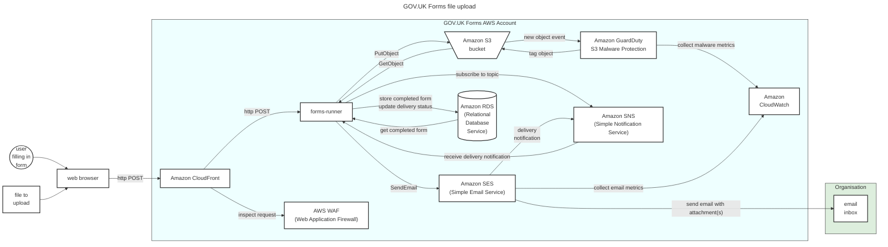
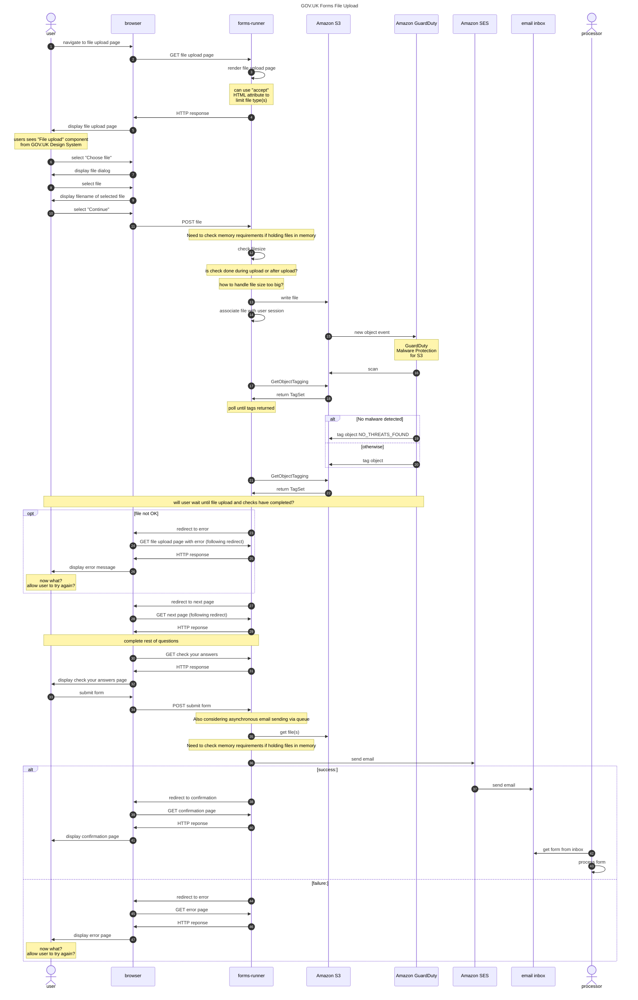
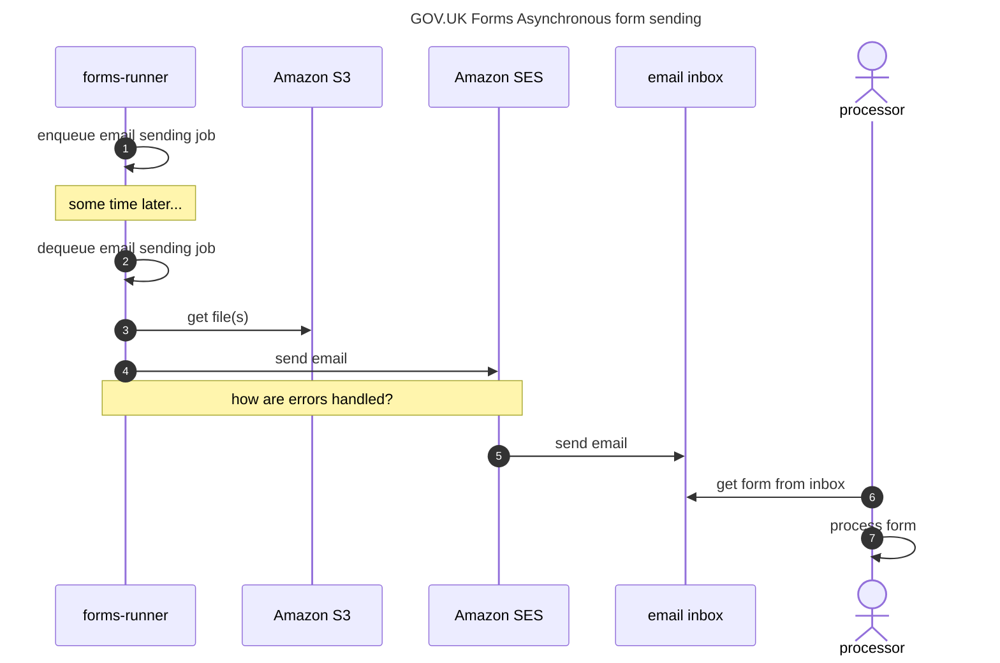

> [!NOTE]
> File upload is under active development, the following is likely to change:

## File Upload Architecture

## Uploading a file when completing a form

## Asynchronous form sending

> [!NOTE]
> Asynchronous form sending has not yet been implemented, these are ideas / proposals:

