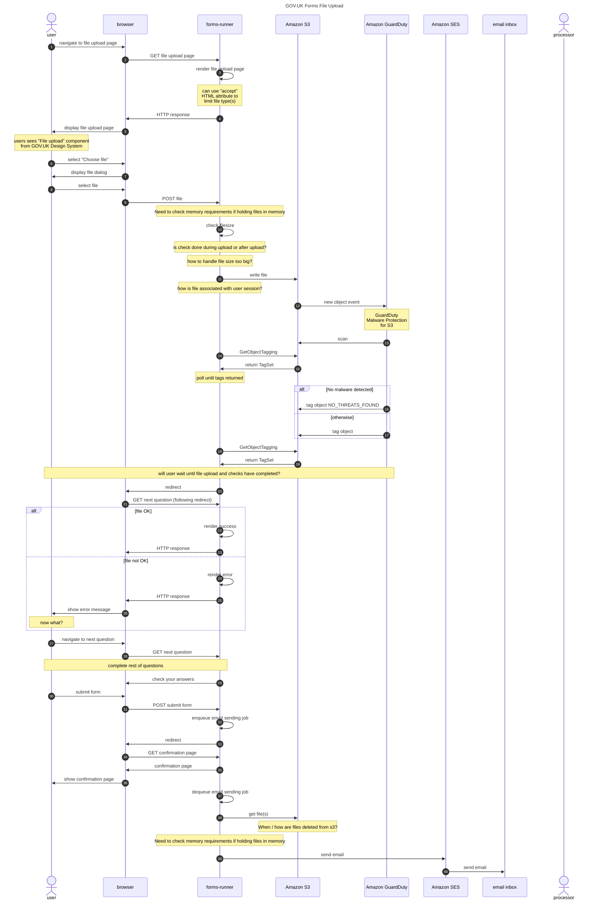

## Uploading a file when completing a form

> [!NOTE]
> File upload has not yet been implemented, these are ideas / proposals:

```mermaid

---
title: GOV.UK Forms File Upload
---

sequenceDiagram


autonumber

actor user

participant browser

participant runner as forms-runner
participant s3 as Amazon S3
participant guard as Amazon GuardDuty
participant ses as Amazon SES
participant inbox as email inbox

actor processor

user->>browser: navigate to file upload page
browser->>runner: GET file upload page
runner->>runner: render file upload page
note over runner: can use "accept"<br />HTML attribute to<br />limit file type(s)
runner->>browser: HTTP response
browser->>user: display file upload page

note over user: users sees "File upload" component<br/>from GOV.UK Design System

user->>browser: select "Choose file"
browser->>user: display file dialog
user->>browser: select file


browser->>runner: POST file
note over runner: Need to check memory requirements if holding files in memory

runner->>runner: check filesize
note over runner: is check done during upload or after upload?

note over runner: how to handle file size too big?

runner->>s3: write file
note over runner: how is file associated with user session?

s3->>guard: new object event
note over guard: GuardDuty<br />Malware Protection<br />for S3
guard->>s3: scan

runner->>s3: GetObjectTagging
s3->>runner: return TagSet

note over runner: poll until tags returned

alt No malware detected
  guard->>s3: tag object NO_THREATS_FOUND
else otherwise
  guard->>s3: tag object
end

runner->>s3: GetObjectTagging
s3->>runner: return TagSet

note over user,guard: will user wait until file upload and checks have completed?

runner->>browser: redirect
browser->>runner: GET next question (following redirect)


alt file OK
  runner->>runner: render success
  runner->>browser: HTTP response
else file not OK
  runner->>runner: render error
  runner->>browser: HTTP response
  browser->>user: show error message
  note over user: now what?
end

user->>browser: navigate to next question
browser->>runner: GET next question

note over user,runner: complete rest of questions

runner->>browser: check your answers

user->>browser: submit form
browser->>runner: POST submit form

runner->>runner: enqueue email sending job

runner->>browser: redirect
browser->>runner: GET confirmation page
runner->>browser: confirmation page
browser->>user: show confirmation page

runner->>runner: dequeue email sending job
runner->>s3: get file(s)

note over s3: When / how are files deleted from s3?

note over runner: Need to check memory requirements if holding files in memory

runner->>ses: send email
ses->>inbox: send email
```
