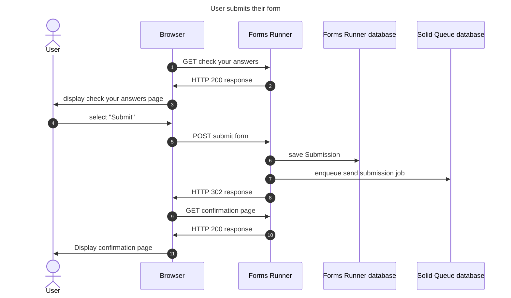
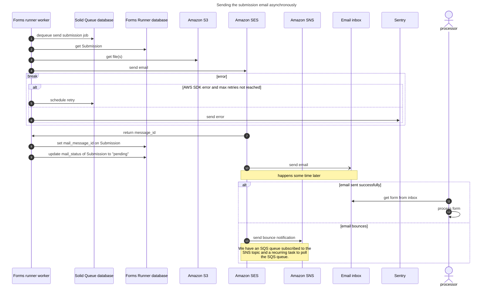
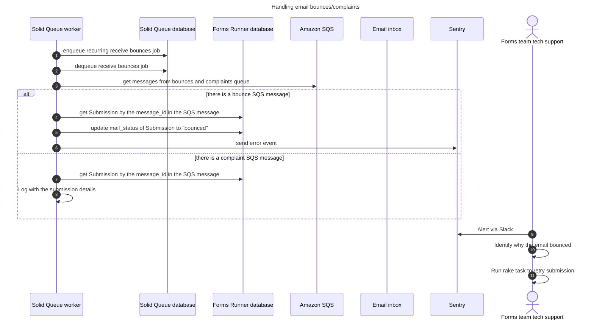

> [!NOTE]
> File upload is under active development, the following is likely to change:

## File Upload Architecture

## Uploading a file when completing a form

### User completes a file upload question

### User submits their form

### Sending the submission email asynchronously

### Handling email bounces/complaints
