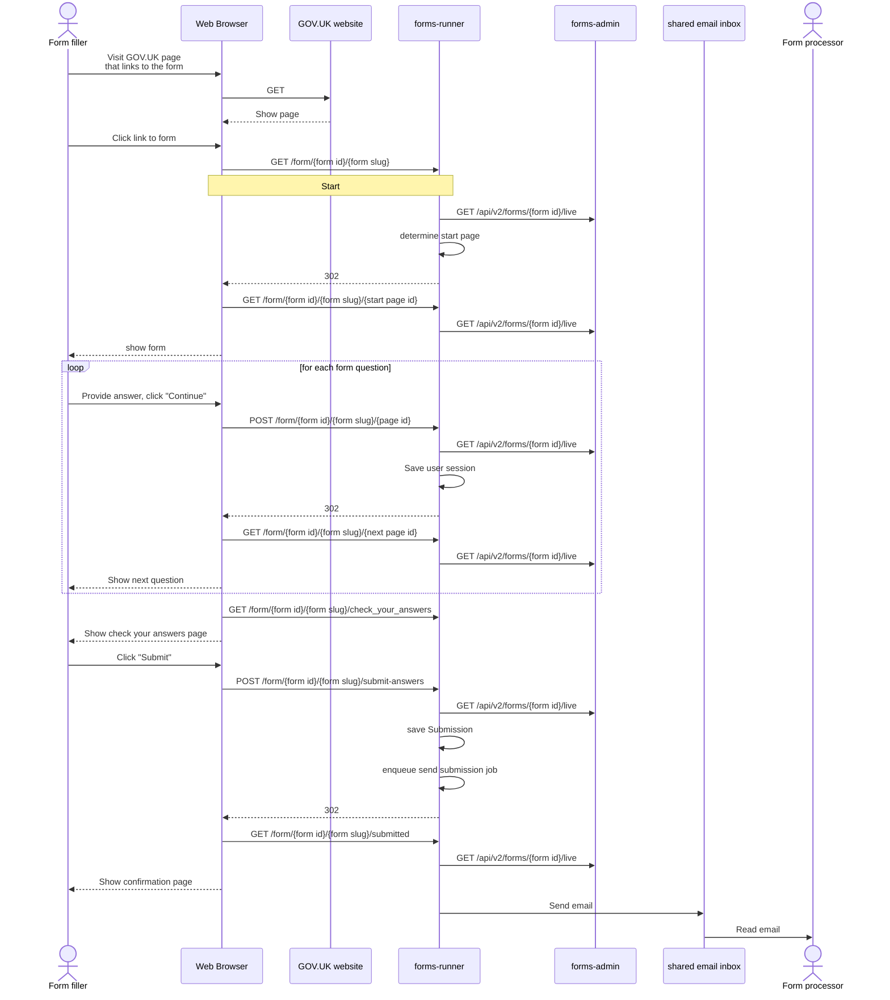
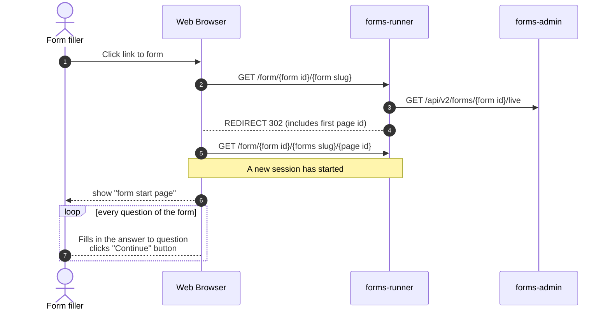

# Filling in a form



## Session management




## Brief summary

The users answers are store in Redis in the following structure as they progress through the form.

```
{
   "answers": {
    "{form id}": {
      "{page id}": {
        ... input field names and their answers...
      },
      "{page id}": {
        ... input field names and their answers...
      },
      ... for each page/question that the users answers
    },
    ... above repeated for each form a users is completing
  }
}
```

The Redis session's TTL is set to 20 hours, the expiry time resets after each request a user makes to
`forms-runner`. 

### Example of Redis session

#### Scenario: 

Two existing forms, Form 1 (id=11), Form 2 (id=22). 
Form 1 has 2 pages, Form 2 has 1 page.

When the user visits the service for the first time but has not answered any questions. 

```
{
  "answers": {},
  "_csrf_token": "blahblahblahblahblah"
}
```

Once a user answers the first question, the form id (In this case Form 1) is recorded as a key and another object with the page id is created along with the fields and answers for that page type. In this case the page id is "1" and it is a name answer type.

```
{
  "answers": {
    "11": {
      "1": {
        "title": null,
        "full_name": "Al",
        "first_name": null,
        "middle_names": null,
        "last_name": null
      }
    }
  },
  "_csrf_token": "blahblahblahblahblah"
}
```

They progress to question 2 of Form 1 and answer that. Again it would be page id "2" and it is a date answer type.

```
{
  "answers": {
    "11": {
      "1": {
        "title": null,
        "full_name": "Al",
        "first_name": null,
        "middle_names": null,
        "last_name": null
      },
      "2": {
        "date_day": "1",
        "date_month": "2",
        "date_year": "2023",
        "date": "2023-02-01"
      }
    }
  },
  "_csrf_token": "blahblahblahblahblah"
}
```

Before submitting the answers for Form 1, the user decides (for whatever reason) to start completing Form 2. Nothing changes when they appear on the first question of the form. Once they have filled in the fields and press "Continue", the form id & page id etc are added to the same redis session.

```
{
  "answers": {
    "11": {
      "1": {
        "title": null,
        "full_name": "Al",
        "first_name": null,
        "middle_names": null,
        "last_name": null
      },
      "2": {
        "date_day": "1",
        "date_month": "2",
        "date_year": "2023",
        "date": "2023-02-01"
      }
    },
    "22": {
      "3": {
        "number": "42"
      }
    }
  },
  "_csrf_token": "blahblahblahblahblah"
}
```

They continue on with Form 2 and submit their answers. The value for Form 2 key (id=22), is set to null but Form 1 answers still persist. 

```
{
  "answers": {
    "11": {
      "1": {
        "title": null,
        "full_name": "Al",
        "first_name": null,
        "middle_names": null,
        "last_name": null
      },
      "2": {
        "date_day": "1",
        "date_month": "2",
        "date_year": "2023",
        "date": "2023-02-01"
      }
    },
    "22": null
  },
  "_csrf_token": "blahblahblahblahblah"
}
```

The user ends up going back to the Form 1 to submit their answers which again sets that form key value to null.

```
{
  "answers":{
    "1":null,
    "2":null
  },
  "_csrf_token": "blahblahblahblahblah"
}
```

#### Expiry

The expiry time resets every time the user refreshed/submits the page (i.e shows some activity happen). The session will also end if the user closes their browser. The CSRF token value does not make the cookie value in the browser but Rails must keep a record of which cookie value related to which particular redis session record.