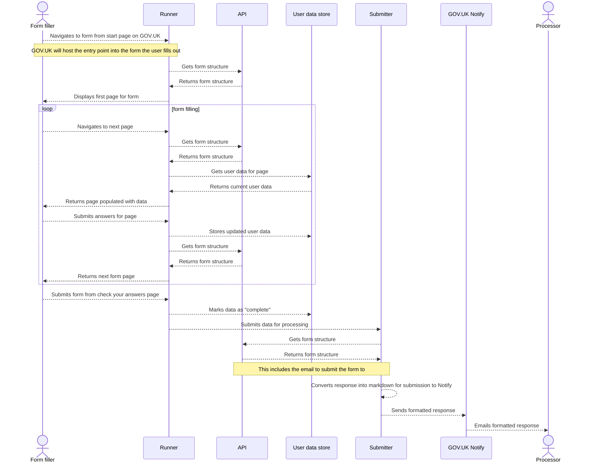

# Filling in a form

```mermaid 
sequenceDiagram
  actor user as Form filler
  participant runner as Runner
  participant api as API
  participant store as User data store
  participant submitter as Submitter
  participant notify as GOV.UK Notify
  actor processor as Processor

  user -->> runner: Navigates to form from start page on GOV.UK
  note over user, runner: GOV.UK will host the entry point into the form the user fills out
  runner -->> api: Gets form structure
  api -->> runner: Returns form structure
  runner -->> user: Displays first page for form
  
  loop form filling
    user -->> runner: Navigates to next page
    runner -->> api: Gets form structure
    api -->> runner: Returns form structure
    runner -->> store: Gets user data for page
    store -->> runner: Returns current user data
    runner -->> user: Returns page populated with data
    user -->> runner: Submits answers for page
    runner -->> store: Stores updated user data
    runner -->> api: Gets form structure
    api -->> runner: Returns form structure
    runner -->> user: Returns next form page
  end

  user -->> runner: Submits form from check your answers page
  runner -->> store: Marks data as "complete"
  runner -->> submitter: Submits data for processing

  submitter -->> api: Gets form structure
  api -->> submitter: Returns form structure
  note over api,submitter: This includes the email to submit the form to
  submitter -->> submitter: Converts response into markdown for submission to Notify
  submitter -->> notify: Sends formatted response
  notify -->> processor: Emails formatted response
```