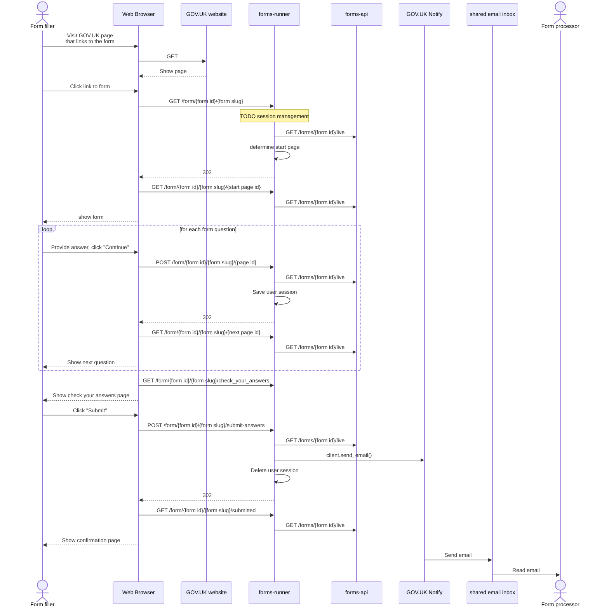

# Filling in a form

```mermaid 
sequenceDiagram
  actor user as Form filler
  participant browser as Web Browser
  participant govuk as GOV.UK website
  participant runner as forms-runner
  participant api as forms-api
  participant notify as GOV.UK Notify
  participant inbox as shared email inbox
  actor processor as Form processor

  user->>browser: Visit GOV.UK page<br />that links to the form
  browser->>govuk: GET
  govuk-->>browser: Show page

  user->>browser: Click link to form
  browser->>runner: GET /form/{form id}/{form slug}
  note over runner: TODO session management
  runner->>api: GET /forms/{form id}/live
  runner->>runner: determine start page  
  runner-->>browser: 302
  browser->>runner: GET /form/{form id}/{form slug}/{start page id}
  runner->>api: GET /forms/{form id}/live
  browser-->>user: show form

  loop for each form question
    user->>browser: Provide answer, click "Continue"
    browser->>runner: POST /form/{form id}/{form slug}/{page id}
    runner->>api: GET /forms/{form id}/live
    runner->>runner: Save user session
    runner-->>browser: 302
    browser->>runner: GET /form/{form id}/{form slug}/{next page id}
    runner->>api: GET /forms/{form id}/live
    browser-->>user: Show next question    
  end

  browser->>runner: GET /form/{form id}/{form slug}/check_your_answers
  browser-->>user: Show check your answers page
  user->>browser: Click "Submit"
  browser->>runner: POST /form/{form id}/{form slug}/submit-answers
  runner->>api: GET /forms/{form id}/live
  runner->>notify: client.send_email()
  runner->>runner: Delete user session
  runner-->>browser: 302
  browser->>runner: GET /form/{form id}/{form slug}/submitted
  runner->>api: GET /forms/{form id}/live
  browser-->>user: Show confirmation page
  notify->>inbox: Send email
  inbox->>processor: Read email
```