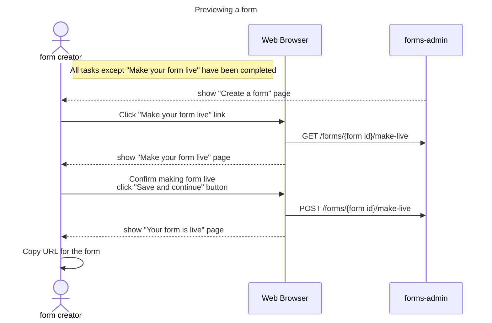
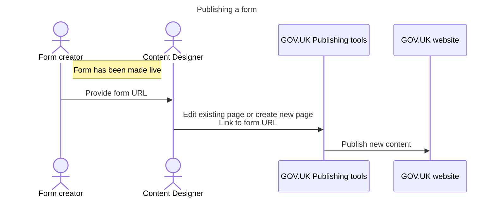

# Making a form live

```mermaid 
sequenceDiagram
  title Previewing a form
  actor user as form creator
  participant browser as Web Browser
  participant admin as forms-admin
  link admin: GitHub repo @ https://github.com/alphagov/forms-admin   

  note right of user: All tasks except "Make your form live" have been completed

  admin-->>user: show "Create a form" page
  user->>browser: Click "Make your form live" link
  browser->>admin: GET /forms/{form id}/make-live
  browser-->>user: show "Make your form live" page

  user->>browser: Confirm making form live<br />click "Save and continue" button
  browser->>admin: POST /forms/{form id}/make-live
  browser-->>user: show "Your form is live" page
  user->>user: Copy URL for the form

```

# Publishing a form

```mermaid 
sequenceDiagram
  Title Publishing a form
  actor user as Form creator
  actor content as Content Designer
  participant publishing as GOV.UK Publishing tools
  participant govuk as GOV.UK website

  note right of user: Form has been made live

  user->>content: Provide form URL

  content->>publishing: Edit existing page or create new page<br />Link to form URL

  publishing->>govuk: Publish new content

```
