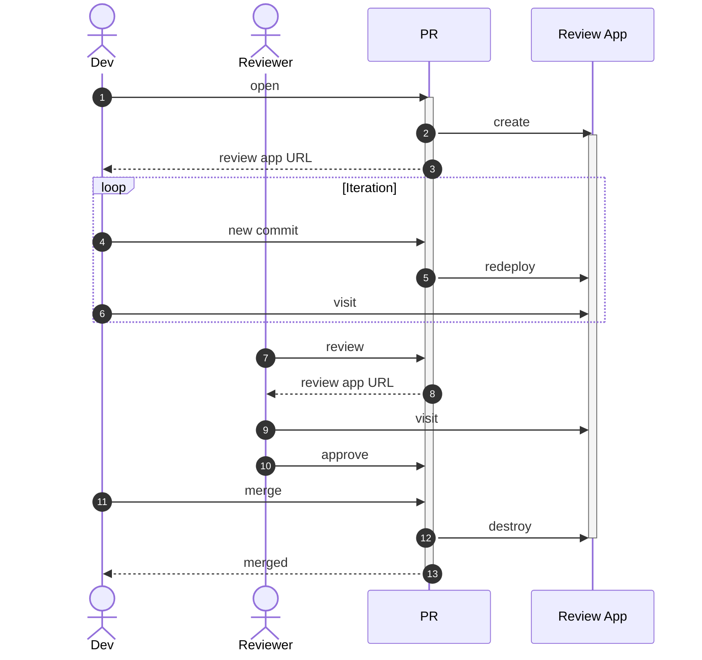

## Workflow for review apps on GOV.UK Forms

```mermaid
%%{init: { "sequence": { "showSequenceNumbers": true }}}%%
        
sequenceDiagram

actor dev as Dev
actor reviewer as Reviewer
participant pr as PR
participant app as Review App

dev ->> pr: open
activate pr

pr ->> app: create
activate app

pr -->> dev: review app URL

loop Iteration
    dev ->> pr: new commit
    pr ->> app: redeploy
    dev ->> app: visit
end

reviewer ->> pr: review
pr -->> reviewer: review app URL
reviewer ->> app: visit
reviewer ->> pr: approve

dev ->> pr: merge
pr ->> app: destroy
deactivate app

pr -->> dev: merged
deactivate pr
```
