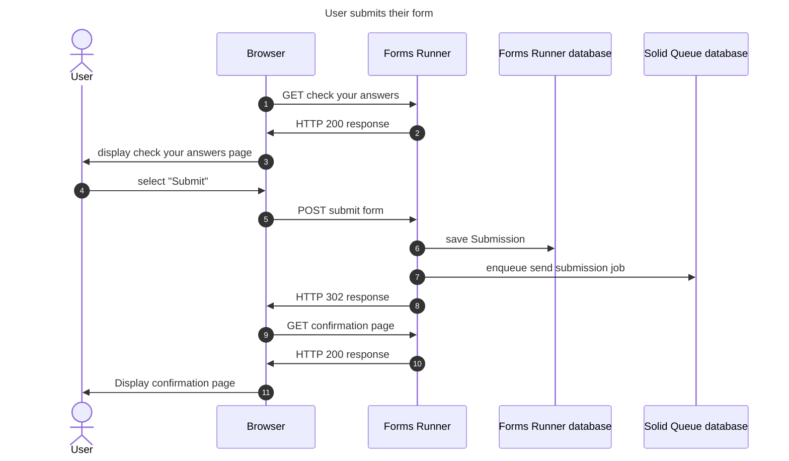
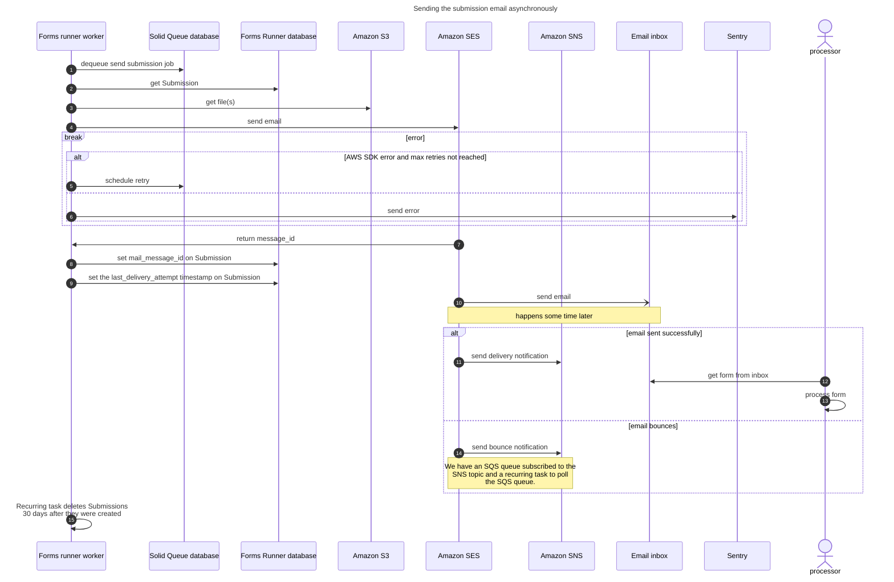
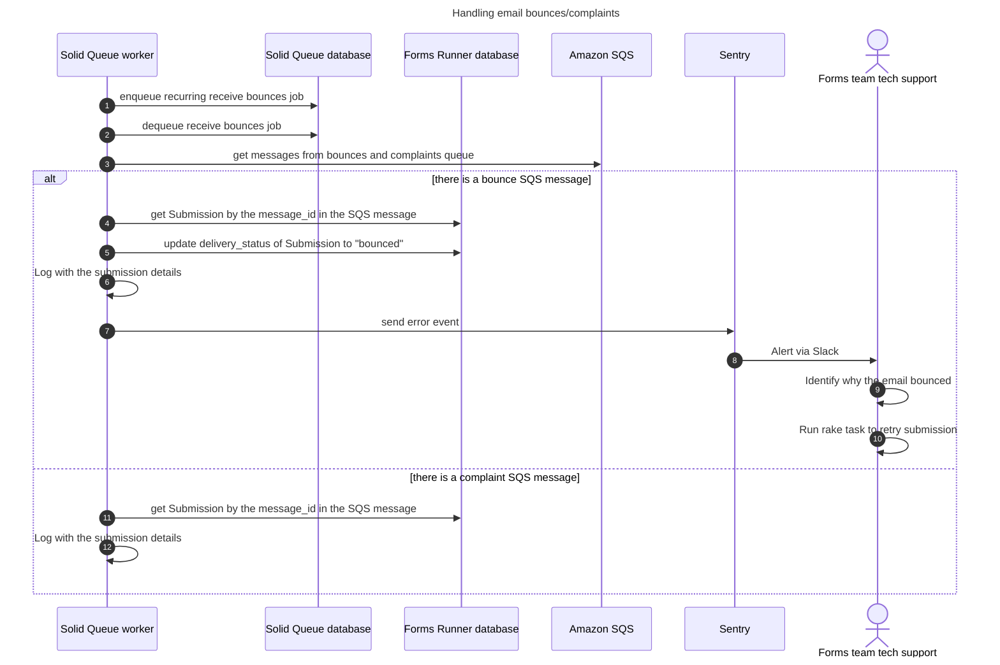
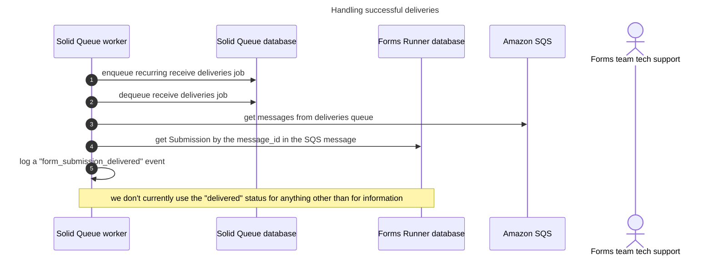

# Sending submission emails asynchronously

forms-runner uses SolidQueue and Amazon SES/SNS to send submissions asynchronously.

## User submits their form

## Sending the submission email asynchronously

## Handling email bounces/complaints

## Handling successful deliveries

