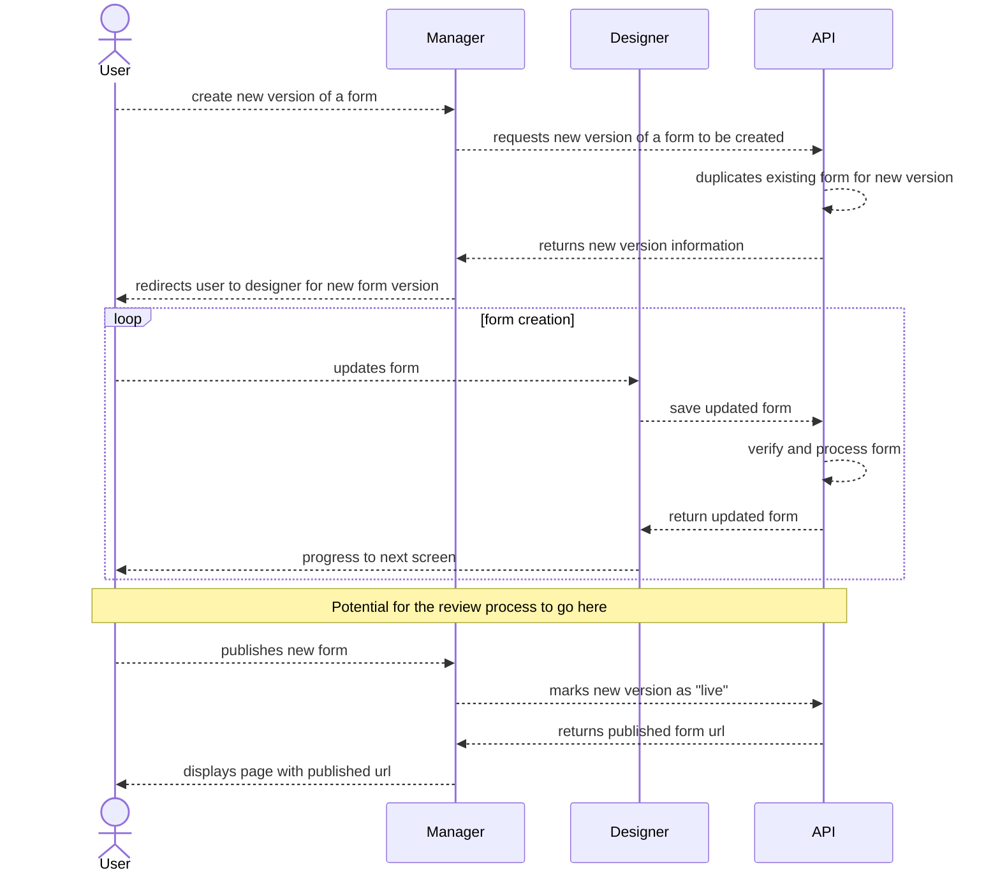

# Updating a published form

```mermaid 
sequenceDiagram
  actor user as User
  participant manager as Manager
  participant designer as Designer
  participant api as API

  user -->> manager: create new version of a form
  manager -->> api: requests new version of a form to be created
  api -->> api: duplicates existing form for new version
  api -->> manager: returns new version information
  manager -->> user: redirects user to designer for new form version

  loop form creation
    user -->> designer: updates form
    designer -->> api: save updated form
    api -->> api: verify and process form
    api -->> designer: return updated form
    designer -->> user: progress to next screen
  end

  note over user,api: Potential for the review process to go here

  user -->> manager: publishes new form
  manager -->> api: marks new version as "live"
  api -->> manager: returns published form url
  manager -->> user: displays page with published url
```
